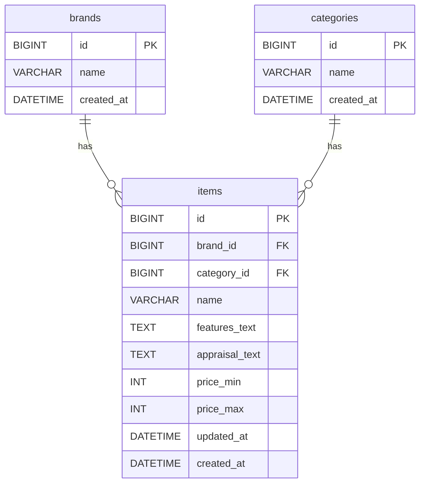
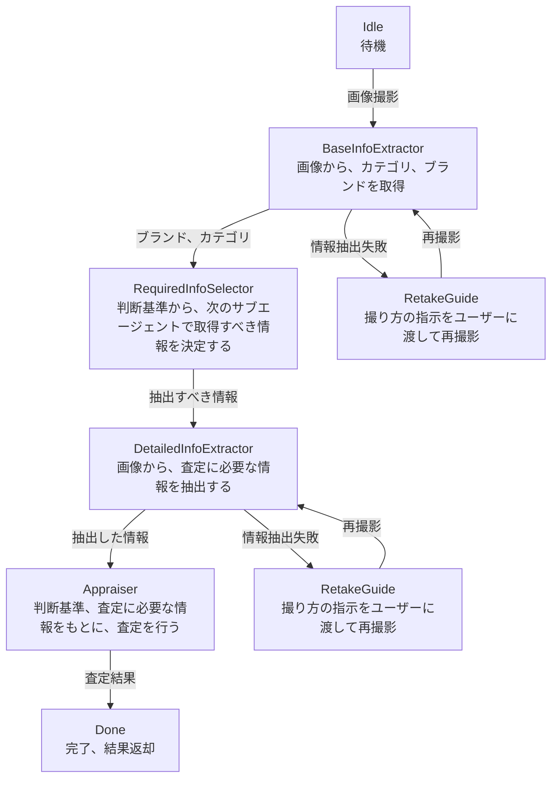
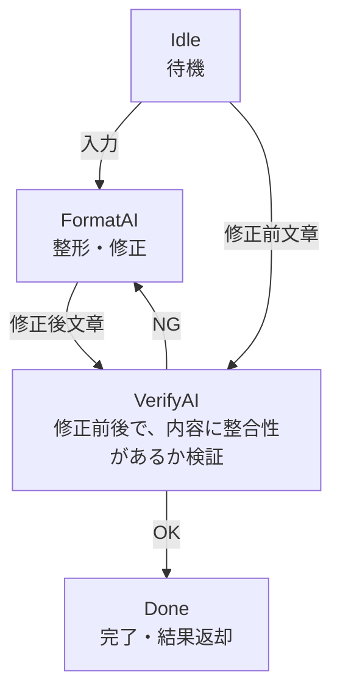

# プロトタイピング要件・設計（古着AI査定アプリ）

実装時に変更があることも考慮して、柔軟に内容は変更する

## 目的
古着の写真を撮影（またはアップロード）すると、AIが類似商品の市場価格を推定し、想定レンジと根拠を提示する。

## 対象ユーザー
- 古着の売買初心者

## コア体験（MVP）
1. 写真を撮る/アップロードする
2. AIがカテゴリ・ブランド・アイテム属性を推定
3. 参考価格レンジ（中央値/上下限）を表示
4. 参考元（類似商品のサムネ・価格帯）を数件表示

## スコープ（プロトタイプ）
### いまやること
- 画像アップロード
- 画像からの属性推定（カテゴリ/ブランド/色/状態）
- 価格推定（レンジ）

### 今回はやらないこと
- 実際の出品・決済
- 在庫管理
- 真贋鑑定
- 画像の設定
- 高度なコンディション診断（ダメージ/改造等の詳細）
- 収集データの長期学習パイプライン
- 信頼度表示
- どこの店にあったかなどのSNS機能

## 主要ユーザーストーリー
- 古着屋でパパッと相場を知りたい
- ブランド名が分からないが推定してほしい
- 相場の幅と根拠を見たい

## 画面・フロー（簡易）
### 1. ホーム/撮影
- カメラ起動/画像アップロード
- 例: 「ブランドタグが見える写真推奨」ヒント

### 2. 解析中
- 進捗アニメーション
- 「推定中：カテゴリ/ブランド/価格」

### 3. 結果
- 推定カテゴリ/ブランド/素材/色など
- 市場価格レンジ（例: 3,000–6,000円 / 中央値 4,500円）

## 機能
### 画像入力
- JPEG/PNG

### 属性推定
- カテゴリ: トップス/ボトムス/アウター/シューズ/バッグ/アクセなど
- ブランド推定: 上位n候補
- 色/素材/季節性など

### 価格推定
- 相場レンジ（下限/中央値/上限）
- 地域補正（日本国内）
- 参考類似件数（N件）

## 技術設計
### 概要
- フロント: Web（スマホ優先）
    - React・Vite・TypeScript
- バックエンド: APIサーバ
    - FastAPI
- 推論: 簡易的なLLMによる画像解析
    - Gemini SDK（学習も兼ねているため、LangGraphなどは一旦使わない）

### データ・推論
- 古着査定コツが記載されているサイトからいくつかスウェットを対象にいくつかブランドを決定し、プロトタイプでのデータとして使用する。
- 画像解析は2段階で行う（簡易→詳細）。
- 1段目（簡易判定）: 画像からブランド候補・カテゴリを推定。
- 2段目（詳細判定）: 推定したブランド/カテゴリに紐づく査定ポイント（テキスト）をDBから取得し、そのポイントに対して画像で判別できるかをLLMに評価させる。
- 判別不能なポイントが多い場合は、再撮影を促す（必要な部位のみをLLMが選び、指示文生成）。

### DB設計メモ（MySQL）
- 査定基準は items テーブルに保持する（appraisal_points は使わない）。
- items.appraisal_text に「商品別の査定基準」を集約する。

## UI要件
- 1画面完結の簡潔UI
- 価格レンジが一目で分かる表示
- 類似商品は横スクロールカード

## 管理ページ
- itemの追加・更新などを行う

## バックエンド構成（FastAPI）

```
backend/
  app/
    api/         # ルーティング + 依存関係
    agents/      # AIエージェント群
    services/    # 推論/査定ロジック
    db/          # DB接続・モデル
    schemas/     # APIスキーマ
  tests/         # テストコード
```

## APIエンドポイント（案）

### 共通

- `GET /` : ヘルスチェック（簡易情報を返す）

### 査定フロー（プロトタイプ簡易版・同期完結）

- `POST /appraisals` : 査定を実行し、結果を即時返却
    - 画像をアップロードして査定する
    - 返却:
        - `status: "done"` の場合: 査定結果（カテゴリ/ブランド/価格レンジ/参考類似など）と `appraisal_id`
        - `status: "retake_required"` の場合: 再撮影指示（`retake_message`）と `appraisal_id`
- `POST /appraisals/{appraisal_id}/images` : 再撮影画像の再評価
    - 追加の画像をアップロードして再査定する
    - 返却:
        - `status: "done"` の場合: 査定結果と `appraisal_id`
        - `status: "retake_required"` の場合: 再撮影指示（`retake_message`）と `appraisal_id`

## フロントエンド構成

```
frontend/
  src/
    pages/      # 画面（ルーティング）
    components/ # UIコンポーネント
    features/   # 機能単位のUI/ロジック
    services/   # APIクライアント
    styles/     # スタイル
    assets/     # 画像・アイコン
    hooks/      # 共通フック
    utils/      # ユーティリティ
  public/       # 静的ファイル
  tests/        # テスト
```

## DB設計



## AIエージェント設計

### 進行管理
- `thread_id` で「1つの査定セッション」を識別する
- 各ステップ終了ごとに状態をチェックポイント保存する（例: Memory/Redis）
- 追加リクエストは同じ `thread_id` を渡して「進行中の状態」に合流する
- サブグラフ単位の永続化有無は `compile(checkpointer=...)` で制御する

### 進行管理（プロトタイプ運用）
- 進行中の保持は `DetailedInfoExtractor` 用の一時バッファのみ
- 保存先は Redis ではなくプロセス内 `dict` を使用
- 必須要素は `payload` のみ（柔軟な JSON）

### 再撮影フロー（AppraisalAgent使い回し）
- `run()` の戻り値に `status` を持たせる（`done` / `retake_required`）
- `retake_required` の場合は `payload` と再撮影指示文を返す
- 再撮影されたら `run(new_image, payload=前回のpayload)` を再実行する
- 完了後は一時 `payload` を破棄する（dictから削除）

### 査定エージェント



### 管理者テキスト整形エージェント


